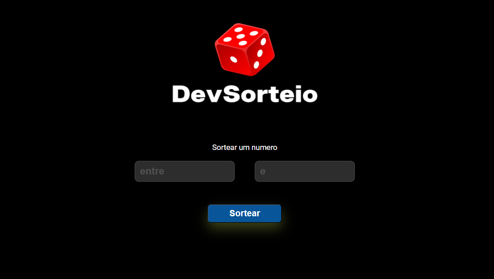

<h1> Sorteador Online </h1>

Sorteador Online
Bem-vindo ao repositório oficial do Sorteador Online, uma ferramenta simples e eficiente para realizar sorteios de forma rápida e transparente. Este projeto foi desenvolvido com o objetivo de proporcionar uma experiência fácil e confiável para a realização de sorteios em diversas situações, desde eventos sociais até sorteios online.

<h2> Tech Stack </h2>

 

<h2> Principais Recursos </h2>

-Interface Intuitiva: Uma interface de usuário amigável que torna o processo de realização de sorteios fácil e acessível para todos.

-Personalização: Possibilidade de personalizar as opções do sorteio, como número de participantes, critérios de elegibilidade e muito mais.

-Transparência e Justiça: O Sorteador Online prioriza a transparência, garantindo um processo justo e imparcial em todos os sorteios realizados.

-Responsividade: Desfrute da mesma experiência de usuário perfeita em dispositivos móveis e desktop.

Como Contribuir:
Sinta-se à vontade para contribuir com sugestões, relatórios de bugs ou até mesmo colaborações no código. Seja parte do desenvolvimento deste projeto e ajude a torná-lo ainda melhor!
# SorteadorOnline
